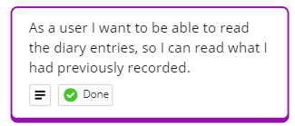
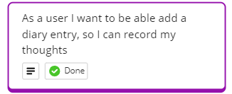
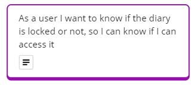
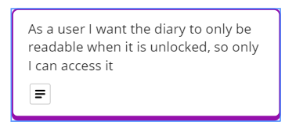
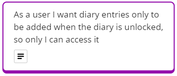

# Secret Diary Pair-Programming Project - Domain Models and test plan

## Diary Code

The following are the user stories, domain models and tests for the Diary class.

## User Story 1

### Domain Model

| Objects    | Properties     | Messages    | Output  |
| ---------- | -------------- | ----------- | ------- |
| secretDiary| - #entries @String[] | - writeDiary() | @void |

### Tests

- [x] the entries array increases in length when writeDiary adds an entry
- [x] an empty or invalid entry should not be added to the diary

## User Story 2

### Domain Model

| Objects    | Properties     | Messages    | Output  |
| ---------- | -------------- | ----------- | ------- |
| secretDiary| - #entries @String[] | - readDiary() | @string[] |

### Tests

- [x] read diary returns an array of strings
- [x] returned strings match what was entered

## User Story 3

### Domain Model

| Objects    | Properties     | Messages    | Output  |
| ---------- | -------------- | ----------- | ------- |
| secretDiary| - #lockStatus @boolean | - getLockStatus() | @boolean |

### Tests

- [x] getLockedStatus should return 'false' when the diary is unlocked
- [x] getLockedStatus should return 'true' when the diary is locked

## User Story 4

### Domain Model

| Objects    | Properties     | Messages    | Output  |
| ---------- | -------------- | ----------- | ------- |
| secretDiary| - #lockStatus @boolean | - unlock(@int) | @void |

### Tests

- [x] entering the correct pin will unlock the diary
- [x] entering the incorrect pin will not unlock the diary
- [x] entering an erroneous value is handled correctly
- [x] entering a null value is handled correctly
- [x] getLockedStatus should return 'false' when the diary is locked and then unlocked

## User Story 5

### Domain Model

| Objects    | Properties     | Messages    | Output  |
| ---------- | -------------- | ----------- | ------- |
| secretDiary| - #lockStatus @boolean | - lock() | @void |

### Tests

- [x] the lock function will lock an unlocked diary

## User Story 6

### Domain Model

| Objects    | Properties     | Messages    | Output  |
| ---------- | -------------- | ----------- | ------- |
| secretDiary| - #lockStatus @boolean   - #entries @String[] | - readDiary() | @string[] |

### Tests

- [x] read diary doesn't return the diaries contents if it is locked
- [x] unlocking a locked diary allows the diary to then return the contents

## User Story 7

### Domain Model

| Objects    | Properties     | Messages    | Output  |
| ---------- | -------------- | ----------- | ------- |
| secretDiary| - #lockStatus @boolean   - #entries @String[] | - writeDiary() | @void |

### Tests

- [x] writeDiary doesn't add to the diaries entries
- [x] writeDiary will add to the entries if the diary is unlocked

---
## Interface code
The following are the user stories, domain models and tests for the

## User Story 8
As a user I want to be able to access the features of my diary through a menu, so I can choose what i want to do with it

### Domain Model
| Objects    | Properties     | Messages    | Output  |
| ---------- | -------------- | ----------- | ------- |

### Tests

- [ ] interface displays option choices
- [ ] interface loops until exit is chosen
- [ ] choosing to read the diary option opens the read method
- [ ] choosing the write to diary option open the write method

## User Story 9
as a user I want to know if my diary is locked or not on the interface, so I know if I need to unlock it or lock it.

### Domain Model
| Objects    | Properties     | Messages    | Output  |
| ---------- | -------------- | ----------- | ------- |
| secretDiary| - #lockStatus @boolean | getLockStatus() | @void |

### Tests

- [ ] interface displays diaries lock status
- [ ] changing the lock status updates the interface

## User Story 10
As a user I want my diary to display my entries if I request them, so I can read what i wrote previously

### Domain Model
| Objects    | Properties     | Messages    | Output  |
| ---------- | -------------- | ----------- | ------- |
| secretDiary| - #lockStatus @boolean | - writeDiary() | @void |

### Tests

- [ ] interface displays diaries lock status